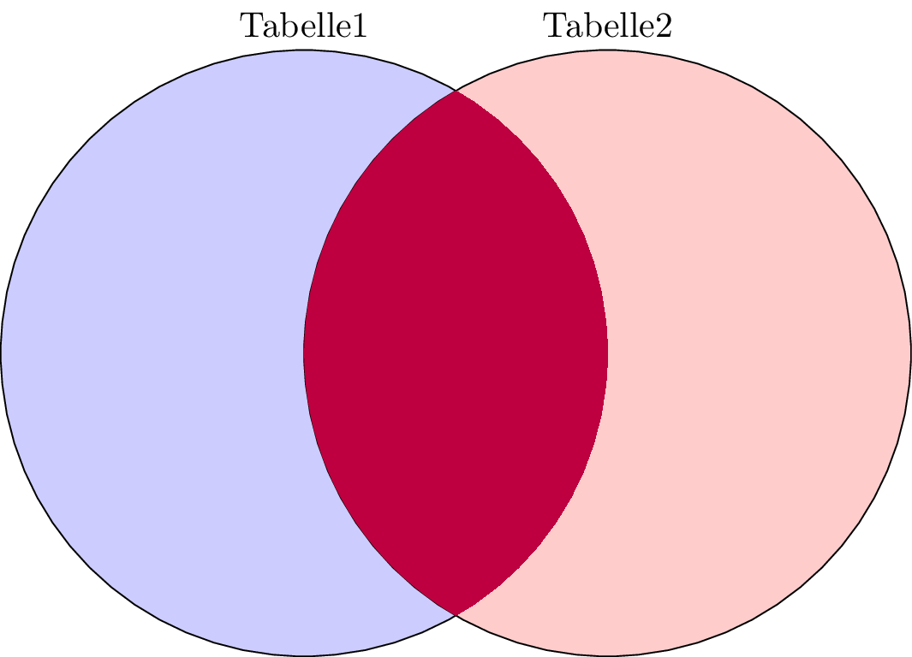

Ein **INNER JOIN** ist eine der grundlegendsten und am häufigsten verwendeten Join-Operationen in SQL (Structured Query Language). Er wird verwendet, um Zeilen aus zwei oder mehr Tabellen in einer Datenbank zu kombinieren, basierend auf einer gemeinsamen Spalte oder einem gemeinsamen Schlüssel zwischen diesen Tabellen.

## Wie funktioniert ein INNER JOIN?


Ein INNER JOIN gibt nur die Zeilen zurück, die in **beiden** Tabellen übereinstimmen. Das bedeutet, dass nur die Datensätze in das Ergebnis aufgenommen werden, für die es in beiden Tabellen einen passenden Wert in der gemeinsamen Spalte gibt. Wenn es in einer der Tabellen keine Übereinstimmung gibt, werden diese Zeilen nicht in das Ergebnis aufgenommen. 



Nur die lila Schnittfläche wird in das Ergebnis aufgenommen.

## Syntax

Die grundlegende Syntax für einen INNER JOIN lautet wie folgt:

```sql
SELECT Spaltenliste
FROM Tabelle1
INNER JOIN Tabelle2 ON Tabelle1.Spalte = Tabelle2.Spalte;
```

- **Spaltenliste:** Die Spalten, die Sie in das Ergebnis aufnehmen möchten. Diese können aus einer oder beiden Tabellen stammen.
- **Tabelle1 und Tabelle2:** Die Tabellen, die Sie verbinden möchten.
- **Tabelle1.Spalte und Tabelle2.Spalte:** Die Spalten, die in beiden Tabellen übereinstimmen und als Grundlage für den Join dienen.

## Beispiel

Angenommen, Sie haben drei Tabellen: `Autoren`, `Bücher` und `Verlage`. Sie möchten eine Liste aller Bücher zusammen mit den Namen ihrer Autoren und den dazugehörigen Verlagen erstellen.

**Tabellenstruktur:**

- **Autoren:** AutorID (PK), Name
- **Bücher:** BuchID (PK), Titel, AutorID (FK)
- **Verlage:** VerlagID (PK), Name, BuchID (FK)

```sql
SELECT Autoren.Name AS Autor, Bücher.Titel AS Buch, Verlage.Name AS Verlag
FROM Autoren
INNER JOIN Bücher ON Autoren.AutorID = Bücher.AutorID
INNER JOIN Verlage ON Bücher.BuchID = Verlage.BuchID;
```

In diesem Beispiel werden nur die Bücher, Autoren und Verlage zurückgegeben, für die es in allen drei Tabellen eine Übereinstimmung in den jeweiligen Fremdschlüsselspalten gibt.

## Anwendungsfälle

- **Datenintegration:** Kombination von Daten aus verschiedenen Tabellen, um eine umfassendere Sicht auf die Daten zu erhalten.
- **Berichterstellung:** Erstellen von Berichten, die Informationen aus mehreren Tabellen benötigen.
- **Datenanalyse:** Analysieren von Daten, die über mehrere Tabellen verteilt sind.

## Zusammenfassung

Ein INNER JOIN ist ein leistungsstarkes Werkzeug in SQL, das es ermöglicht, Daten aus verschiedenen Tabellen zu kombinieren und so komplexe Abfragen und Analysen durchzuführen. Durch das Verständnis und die Anwendung von INNER JOINs können Sie die Effizienz und Effektivität Ihrer Datenbankabfragen erheblich verbessern.